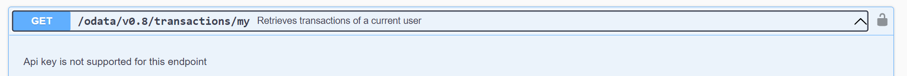

# Asset configuration

## Assets availability configuration

For the assets shown in the WLA, there are various configuration possibilities.

We understand that you can have users with different locales. You can provide \[en] and \[de] translations for the assets descriptions, for data policy. Depending on the language settings of the mobile phone, the WLA will either take the information from \[en] or \[de]. With "\*\***- \*\***" you define the fallback file. For example, in the example below English files are defined as fallback option which means that if user with French locale comes, he will see English version of data.&#x20;

```
"localization": {
		"**-**": "localization/en-US.json",
		"en-**": "localization/en-US.json",
		"de-**": "localization/de-DE.json",
		"assets-**-**": "[en]Assets.v1.json",
		"assets-en-**": "[en]Assets.v1.json",
		"assets-de-**": "[de]Assets.v1.json",
		"datapolicy-**-**": "[en]datapolicy.md",
		"datapolicy-en-**": "[en]datapolicy.md",
		"datapolicy-de-**": "[de]datapolicy.md"
	},
```

Data policy files and asset files for corresponding language must be placed in the root folder  **trading-app-configs** and path to them must be defined in the ui config as described above**.**

Each asset must be configured in the \[\*\*]Assets.json with the following parameters

```
{
"name": "Test Asset en",
"uniqueAssetId": "0x0dd5ec6b49e94d8ac762f0001"
"ticker": "TEST",
"icon": "icons/swiss_francs.png",
"url": "https://en.wikipedia.org/wiki/Old_Master",
"uom": "CHF"
},
```

* Any name can be put to an asset
* For each asset to be shown in WLA, the correct unique asset ID is needed \
  The asset ID can be copied from the WLM, when the corresponding asset is selected in WLM (see Figure 4)
* Any ticker can be put to an asset (optional field)
* Any Icon can be put to an asset (optional field)\
  We recommend to place all icons in the folder with the path **trading-app-configs/icons**
* Any URL can be put to an asset, to show more information when the user clicks on it (optional field)
* Finally, the correct unit of measure should be entered

<figure><figcaption><p>Figure 4: Unique Asset Id can be found in Asset details and copied right from there</p></figcaption></figure>

## Zero balance assets displaying

If you want assets to be displayed in “My Asset” screen, even when the wallet has no Sparks, then the parameter _"show\_absent\_assets\_in\_my\_asset\_list"_ must be set to true, and all corresponding uniqueAssetIdss need to be typed in here

```
"assets": {
"show_absent_assets_in_my_asset_list": true,
"limit_absent_list": [
"628250158773558491489789",
"1196885423266613894240897",
]
```

If only Assets should be listed which have Sparks, then set the parameter _"show\_absent\_assets\_in\_my\_asset\_list"_ to false.

## ​Asset order

If you want to define default order of the assets to be displayed in the list of assets you can use the parameter below.

In the example below assets are order by the amount of units of measure on the balance in the descending order.&#x20;

* sort\_direction can have values "desc" (descending) and "asc" (ascending)
* sort\_by can have any asset object property as a value (for example, uomValue, name, description)

```
"assets": {
	"sort_by": "uomValue",
	"sort_direction": "desc"
},
```
