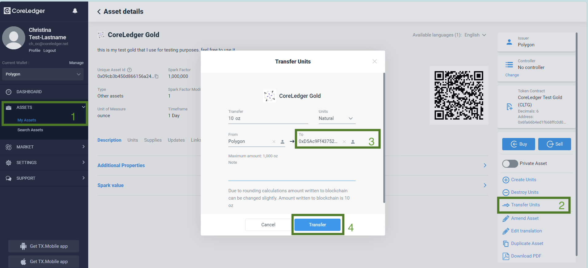
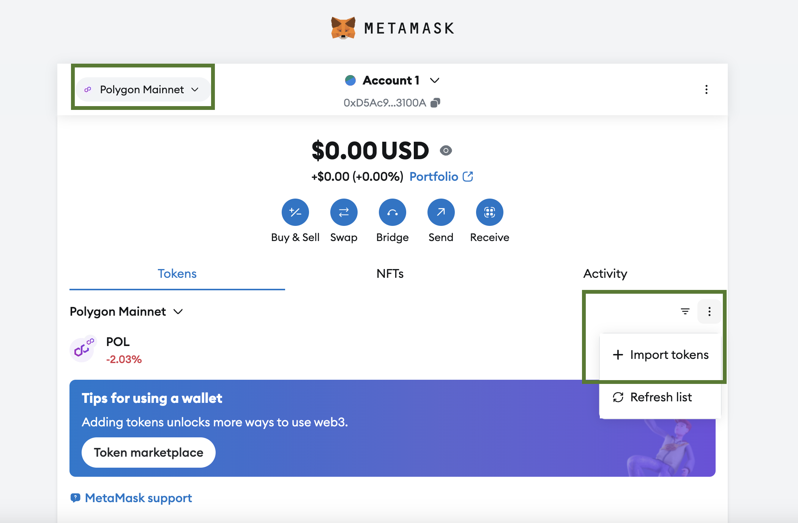
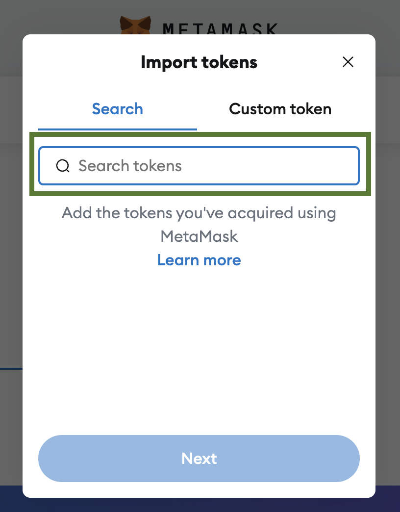
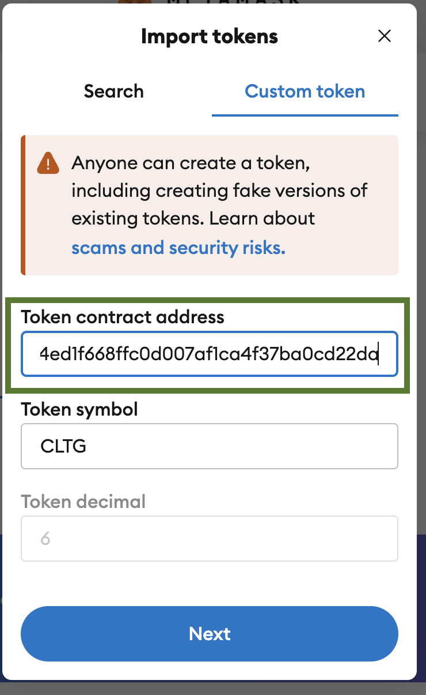
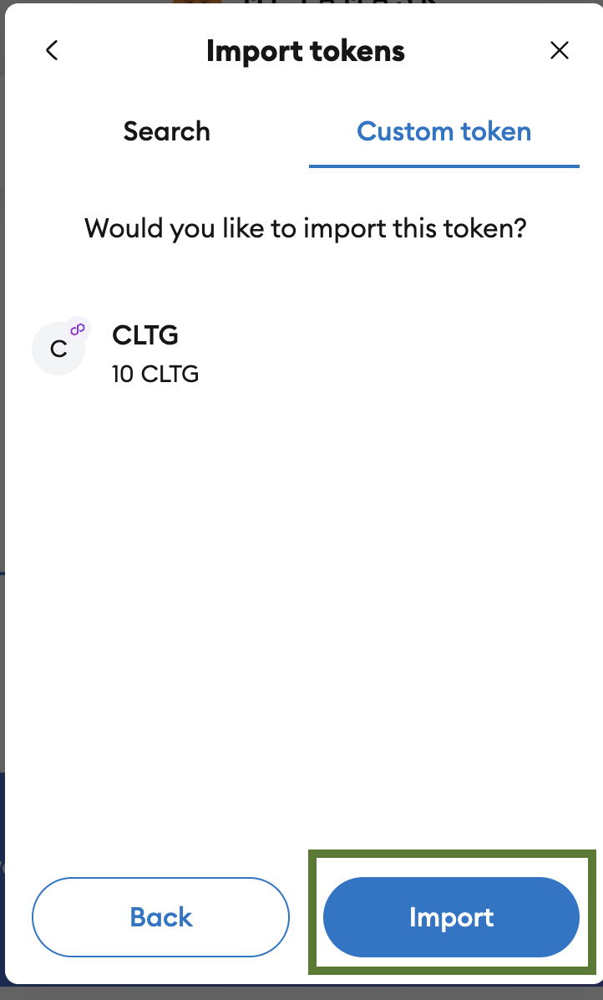
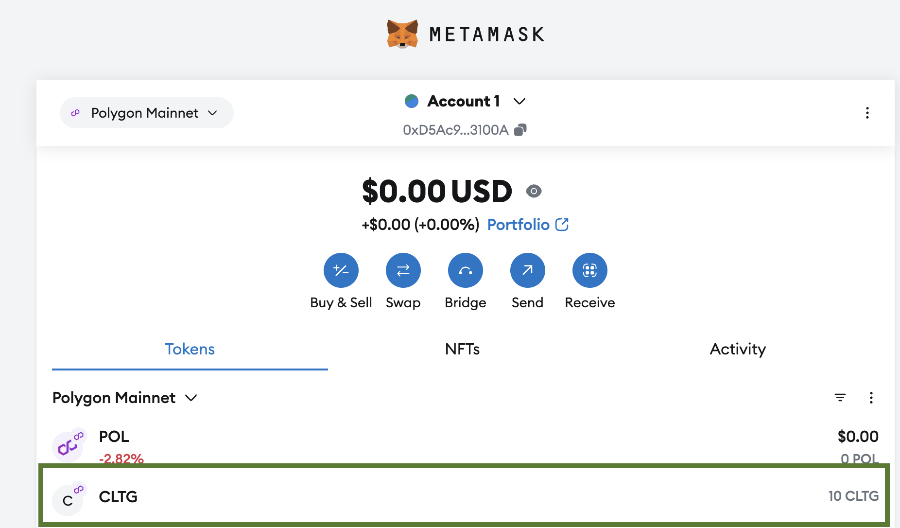

# How to transfer tokens to the external wallet?

### How to transfer tokens from WLM?

1. Go to “Asset-My Assets” on the left menu in the WLM.
2. Select “Transfer Units” from the right menu.
3. In the window that opens, enter the amount you want to transfer, network and your wallet address.
4. Click on “Transfer” button.

<figure><figcaption></figcaption></figure>

### How to add a custom token to Trust Wallet?

1. Open your Trust Wallet. Go to the main screen and click “Manage crypto” below the list of all tokens.

<figure><figcaption></figcaption></figure>

2. Click on “Didn't see your crypto? Import.”

<figure><figcaption></figcaption></figure>

3. Select the token network you need, e.g. Polygon

<figure><figcaption></figcaption></figure>

4. The “Add Custom Asset” screen will appear. You need to add here the Token contract, which you can find in WLM.

<figure><figcaption></figcaption></figure>

You can find this token contract address in the WLM on your "Asset detail" page in the right menu.

<figure><figcaption></figcaption></figure>

5. You can check your token and click the “Add token” button.

<figure><figcaption></figcaption></figure>

6. You can see your token on the main screen.

<figure><figcaption></figcaption></figure>

### How to add a custom token to MetaMask?

1. Open your MetaMask wallet. Go to the main screen, select your token network and сlick on " Import" button.

<figure><figcaption></figcaption></figure>

2. Select "Custom token". You should fill out "Token contract address". &#x20;

<figure><figcaption></figcaption></figure>

You can find this address in the WLM on your "Asset detail" page in the right menu.

<figure><figcaption></figcaption></figure>

3. Fill out "Token contract address". Token symbol and token decimal will be added automatically. Click on "Next" button.

<figure><figcaption></figcaption></figure>

4. Check your token and click on "Import" button.

<figure><figcaption></figcaption></figure>

5. You can see your token on the token list.

<figure><figcaption></figcaption></figure>
