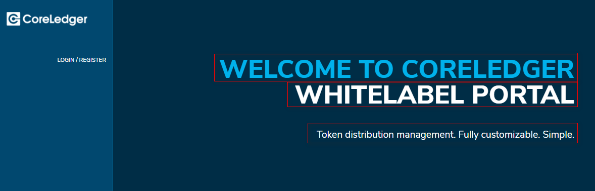

# Branding management

### Application colors - Stylesheet

With the “styles.css” file the colors (HEX) of the WLP as well as the size of the logo can be modified. The file can be found in the blob storage of your WLP.

### Company logo and Favicon

The logo shown in the top left corner of each page in the WLP can be configured via the “Config Management” editor. The logo needs to be stored in the blob.

Go to **Advanced** **Configuration Management** page to provide file name of your logo. File name needs to be inserted in the config file by changing the parameter “logo”.

“logo”: “icons/logo.png”

The Favicon, shown in the browser tab, needs to be uploaded as .png into the “WLP-config” folder in the blob storage.&#x20;


The name of the favicon file needs to be “favicon.png”, then it is automatically shown in the UI.


### Configure text of landing page

Go to **Advanced** **Configuration Management** page to setup currency

Here you can define and modify the texts which are shown at the welcome page as shown in Figure 4.

“landingPage”: {

“primaryHeaderText”: “Welcome to Coreledger”,

“secondaryHeaderText”: “Whitelabel Portal”,

“subHeaderText”: “Token distribution management. Fully customizable. Simple.”

},

### Imprint configuration

The imprint section can be accessed via the button on the bottom of the sidebar. When clicking on “Imprint” the imprint page opens, showing the available information. Administrators can edit the information via the configuration management. Company name, company address, phone number and email address can be provided.

Additionally, the imprint section can be fully customized with an individual html. The custom html needs to be uploaded in the blob storage and the path needs to be provided in the configuration management “customHtmlSourcePath”. Check [here how to prepare custom HTML](how-to-prepare-custom-html.md)

`"imprint": {`

`"company": "testcompany",`

`"address": "teststreet 39",`

`"phone": " 067728283",`

`"email": "testmail@company.com ",`

`"customHtmlSourcePath": "drafts/anything/anything.html"}`


We highly recommend to provide email by which your end-users can contact you. If you don't provide it, all texts, where it should be shown, will be empty&#x20;


``
