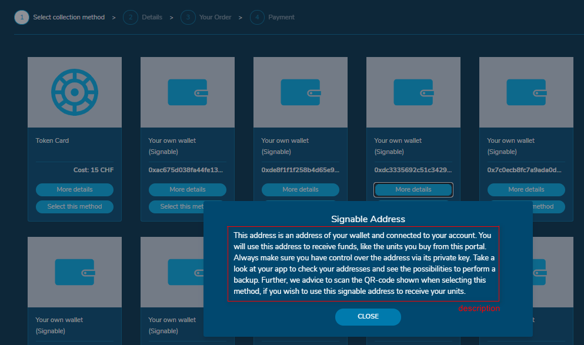

# Purchase assets and Featured asset

## Asset configurations

The WLP can be used for selling a range of assets, just like a web shop for tokens. Additionally, the WLP can be configured for a custom purchase, where one token is highlighted and shown in a custom html page. Also, don't forget to configure[ reference code template ](./#reference-code-template)which is used both for purchase reference codes and redemption reference codes.

### Assets available in the shop

Assets sold in the WLP must first be created using WLM and afterwards be configured for WLP in the **“Advanced Config Management”** editor.

Each asset must be configured with the following parameters in order to be presented under "Purchase assets".

:tada: Starting from v0.11 you can define KYC tier which users must have for each asset to be able to buy it (check below parameter "kycTier"). [Read more about KYC configurations](kyc-checks.md)

```
{
“name”:”CoreLedger AG Share”,
“assetId”:”897131459254702105916269”,
“description”:”New future of finance by making investing as easy and transparent as possible for capital increase, shareholder agreements, etc.”,
“ledgerId”:”1”,
“ticker”:”CLAG”,
“icon”:”icons/coreledger_200x150.jpg”,
“price”:”40”,
“url”:”https://coreledger.net/”,
"maxAmount": 4000000000,
“issuerAddress”: “0xe509ceded28027b3d0d4c105700008c4f6530fbe”,
"kycTier": 1
},
```

* Any name can be put to an asset
* For each asset to be shown in WLP, the correct asset id is needed
* A description about the asset can be added (optional field)
* Ledger ID can be kept 1 for Pilot users
* Any ticker can be put to an asset (optional field)
* Any icon can be put to an asset (optional field). The icon must be available in the blob storage and the respective path must be entered in the config file.
* A price per Unit must be defined
* Any URL can be put to an asset, to show more information when the user clicks on it (optional field)
* Maximum amount of sparks a user can purchase
* The issuer address of the asset must be defined. This is used for e.g. calculating the availability of the asset.
* KYC tier which users must have in order to buy this asset. For all other users possibility to buy this asset will be closed by "Get tier N" sign

### Featured asset

Assets shown in the WLP custom purchase page must first be created using WLM and afterwards be configured for WLP in the “Advanced config management” editor.

Asset must be configured with the following parameters.

```
{
“name”:”CoreLedger AG Share”,
“assetId”:”897131459254702105916269”,
“description”:”New future of finance by making investing as easy and transparent as possible for capital increase, shareholder agreements, etc.”,
“ledgerId”:”1”,
“ticker”:”CLAG”,
“icon”:”icons/coreledger_200x150.jpg”,
“price”:”40”,
“url”:”https://coreledger.net/”,
"maxAmount": 4000000000,
“issuerAddress”: “0xe509ceded28027b3d0d4c105700008c4f6530fbe”
"isFeaturedAsset": true,
"kycTier": 0,
},
```

In difference to the purchase assets there is one additional parameter to be set.

* “isFeaturedAsset” can be switched on and off, with “true” or “false”

```
"features": {
"purchase": true,
"customPurchase": true,
"redeem": true,
"account": true
},
```

* In the customPurchaseSettings the name of the sidebarLink can be defined

```
"customPurchaseSettings": {
"sidebarLink": "Webshop",
"customHtmlSourcePath": "custom-html/template-nonloggedin.html",
"customHtmlSourcePathLoggedIn": "custom-html/template-loggedin.html"
},
```

* The custom html must be uploaded in the blob storage in the wlp-config folder/custom-html. Then, under “customHtmlSourcePath” the link to the custom html page can be entered. Check [here how to prepare custom HTML](../how-to-prepare-custom-html.md)

You can use different custom HTML pages for logged in and non-logged in users. In case you don't want to differentiate them, you can provide only one HTML and set source path to it in the entry "customHtmlSourcePath".

## Collection methods configuration

Under this section the collection methods can be enabled / disabled and configured. Currently four collection methods “Token Card”, “Your own wallet”, “Non signable wallet” and “One time wallet” are available.

For each collection method you have the possibility to enable / disable it (“enabled”) and some details can be defined (“details”) as text (see Figure 6). You can define a fee which is requested for the payment method (“fee”) and some additional fee based on the selected country (“countryFees”).

Furthermore, you can define a fallback fee which is applied in case a special country is selected, but no payment method specific fee was defined for this country (“fallbackCountryFees”).

The “one time wallet” offers the user the possibility to send the tokens to any external Ethereum address. Please note, that not all external Ethereum wallets support unlisted tokens. Additionally, if the external Ethereum wallets support unlisted tokens, they might need to be configured separately.&#x20;

:tada:Starting from v0.11 you can define the text of the disclaimer for one time Ethereum wallet to make sure your users understand their responsibility of using correct address, use "disclaimer" entry for it.

```
“collectionMethods”: {
“tokenCard”: {
“enabled”: true,
“details”: “https://coreledger.net/”,
“fee”: 15,
“countryFees”: {
“AT”: 2,
“DE”: 3,
“CH”: 4,
}
},
“signableAddress”: {
“enabled”: true,
“details”: “This address is an address of your wallet and connected to your account. You will use this address to receive funds, like the units you buy from this portal. “,
“fee”: 5
},
“nonSignableAddress”: {
“enabled”: true,
“details”: “This is an advanced option to receive units and should only be used by experienced and well trained users. You probably imported an address if you are able to select this option.”,
“fee”: 0
},
“fallbackCountryFees”: {
“AT”: 9
}
},
"oneTimeWallet": {
"enabled": true,
"details": "You can send the tokens to any external Ethereum wallet which supports ERC-20 Tokens. Just provide the public address of your wallet after selecting this method.",
"disclaimer": "I understand and accept that I am responsible for using a wallet that supports custom tokens and for providing the correct wallet address. I understand that using a wallet that does not support custom tokens, or with an incorrect address (any typo will result in sending items of the ordered asset to the wrong address), I won't be able to receive and manage items of the ordered asset and that, even though the order may be completed, I won't be able to request refund."
},
"fallbackCountryFees": {
"CH": 1.5,
"DE": 4
}
},
```



## Payment methods configuration

The payment methods used to purchase products can be configured in this section. Currently the following three payment methods available: “Bank Transfer”, “Credit Card” and “Cryptocurrencies”.

Each method can be enabled / disabled (“enabled”) and a description can be defined (“description”).

:tada: Starting from v0.11 you can define KYC tier which users must have for each asset to be able to use it during checkout process (check below parameter "kycTier"). [Read more about KYC configurations](kyc-checks.md)

### Bank transfer

For the payment method “Bank Transfer” the bank details of the receiving account must be configured, descriptions for each field of bank details are optional, in case you provide them, users will see them in info tooltip.

```
“paymentMethods”: {
“bankTransfer”: {
“enabled”: true,
“kycTier”: 1,
"description": "Transfer from account to account.",

"beneficiaryName": {
  "value": "CoreLedger AG",
  "description": "Name of the beneficiary (company name)"
},

"beneficiaryAccount": {
  "value": "CH3908704016075473007",
  "description": "IBAN or an alternative of the beneficiary"
},

"beneficiaryBankName": {
  "value": "Zürcher Kantonalbank",
  "description": "Bank name of the beneficiary"
},

"beneficiaryBankAddress": {
  "value": "Dorfstrasse 18, 0000 Dorf, CH",
  "description": "Bank name of the beneficiary"
},

"beneficiaryBic": {
  "value": "",
  "description": "BIC (bank code) of the beneficiary, optional field"
},

"beneficiarySwift": {
  "value": "CH397",
  "description": "SWIFT (international bank code) of the beneficiary, optional field"
},
```

You can also add up to 3 additional bank ids (apart from SWIFT or BIC) in case your bank has them. You have to provide name and value for each of them and you have possibility to add optional description.

```
"beneficiaryAdditionalBankIdentifiers": [
  {
    "name": "Mandatory name",
    "value": "Mandatory value",
    "description": "Optional description"
  },
],
```

:tada: Starting from v0.10 you can add details of intermediary bank in case your bank has it for international payments.

```
"intermediary": {
  "bankName": "Central Bank",
  "swift": "CHXX XXX XXX",
  "account": "CHXXX XXXX XXX XXX XX"
}
```

### Credit card

For using credit card payment via [Payrexx](https://www.payrexx.com/en/home/) productively you will have to provide your Payrexx account details to our project manager, enable this method and customize its look and feel. For pilot project with Active Sandbox you can start without your own account, we let you use CoreLedger test account.

```
“creditcard”: {
“enabled”: true,
“kycTier”: 0,
“description”: “Use Payrexx to checkout.”
},
```

### Cryptopayment

For using cryptocurrencies payment via [Coinify ](https://www.coinify.com/)productively you will have to provide your Coinify account details to our project manager, enable this method and customize its look and feel. For pilot project with Active Sandbox you can start without your own account, we let you use CoreLedger test account.

```
“bitcoin”: {
“enabled”: true,
“kycTier”: 2,
“description”: “Use Coinify to pay with Bitcoin.”
}
```
