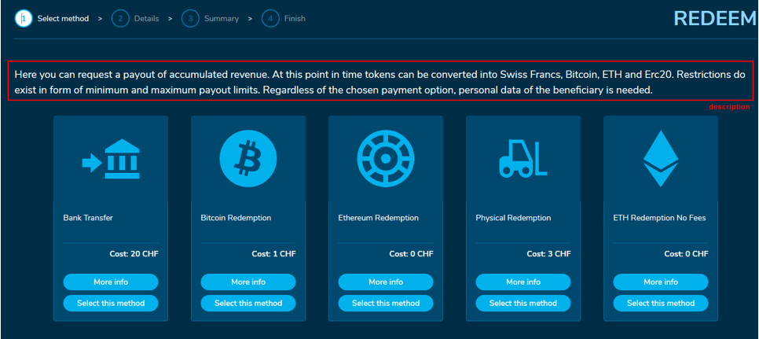
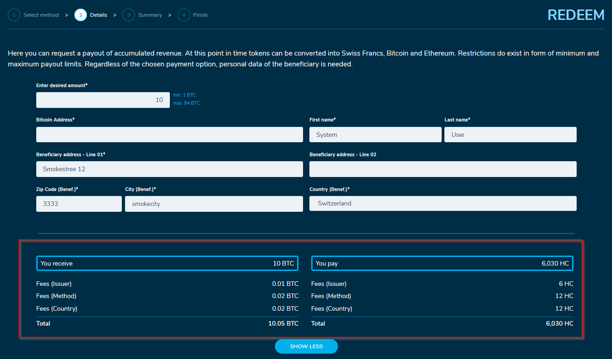

# Redemption functionality

Full configuration of Redemption functionality includes following steps:

1. Configure redemption methods (one method is configured for redeeming one specific asset for receiving fiat money/cryptocurrency/physical asset as a payout) as described below
2. Prepare template for sending redemption details to users via the email   [template-for-redemption-details.md](template-for-redemption-details.md "mention")
3. Also, don't forget to configure[ reference code template ](../#reference-code-template)which is used both for purchase reference codes and redemption reference codes

In this section you can define a description which is shown on the first screen of the redeem process

Following redemption methods are currently available: “Bank Transfer”, “Bitcoin”, “ERC20”, “Physical” and “ETH”.

You can define KYC tier which users must have for each redemption method to be able to use it (check below parameter "kycTier"). [Read more about KYC configurations](../kyc-checks.md)



Depending on the selected redemption method, the user can provide the bank account details, bitcoin address, ETH address, or delivery address to receive the selected value when doing the redemption.

The WLP admin can set up each of those redemption methods via the Advanced Config Management. Example redemption type “bank”:

The admin must define a unique “id” for the redemption method.\
Moreover, the admin needs to set the asset id (“assetId”) of the asset the user should be able to redeem. Any icon can be put to a redemption (optional field). The icon must be available in the blob storage and the respective path must be entered in the config file.

Additional information can be provided with the “description” and the checkbox details.

To specify what the "userGets" it needs a unit of measure ("uom"), this could be different currencies, ETH, BTC, any ERC-20 and even the uom of physical goods the user receives after a successful redemption.\
Additionally, the admin can define a minimum and maximum amount for the redeem process (“minAmount”, “maxAmount”). Only amounts between those values are allowed for the redeem process.\
A “methodFee” can be set, which will be charged when selecting the respective method. Furthermore, a “countryFee” can be set and is charged when the respective country is selected. For country specific fees, a fallback country fee can be configured (“fallbackCountryFees”). This fee will be charged in case no method specific country fee was configured. Finally, a separate issuer Fee can be configured if needed (“issuerFee”).

The fees will be shown and calculated in the denomination of the defined uom.

The amount which a user needs to redeem, in order to receive one uom of a defined asset (e.g., EUR), can be set with the “conversationRate”. E.g., redeeming XYCoin to receive EUR with a conversation Rate of 2.5. means, that the user needs to send 2.5 XYCoins to get 1 EUR.

Finally, the admin needs to define the redemption asset, which the user needs to send. In the section “userPays” the admin needs to set the “assetid”, a name and a uom.

```
{
"type": "bank",
"enabled": true,
"kycTier": 1,
"id": "0000-342-34242-123131",
"name": "Bank Transfer - National",
"icon": "icons/gemstone_200x150.jpg",
"description": "Request a redemption from XY",
"additionalCheckboxesDetailsScreen": [
"I agree to the Terms of Bank transfers and Payouts and confirm that the information above is correct."
],
"additionalCheckboxesSummaryScreen": [
"I hereby confirm that the order is binding and I have to deposit the regarding amount within 3 working days.",
"I hereby confirm that I use the correct amount and Payment Reference, otherwise funds could be lost."
],
"showTermsAndConditionsCheckbox": true,
"userGets": {
"uom": "EUR",
"minAmount": 5,
"maxAmount": 600,
"conversionRate": 0.02,
"feesWithheld": {
"issuerFee": 4,
"methodFee": 2,
"countryFees": {
"AT": 1.5,
"DE": 8,
"CH": 0,
"US": 1
},
"fallbackCountryFee": 5,
"feesOnTop": false
}
},
"userPays": {
"targetAddress": "0x46f4f3fa75df1b2112e3a7303895bf9dacd4bba9",
"assetId": "0x46f4f3fa75df1b2112e3a7303895bf9dacd4bba9",
"name": "Carbon",
"uom": "kg"
}
},
```

Depending on the “feesOnTop” parameter the price gets calculated. When set to true, the user gets exactly the amount desired, as shown in Figure 1.

When set to false, the user gets the desired amount minus the fees, because fees get subtracted from the desired amount, see Figure 2.




