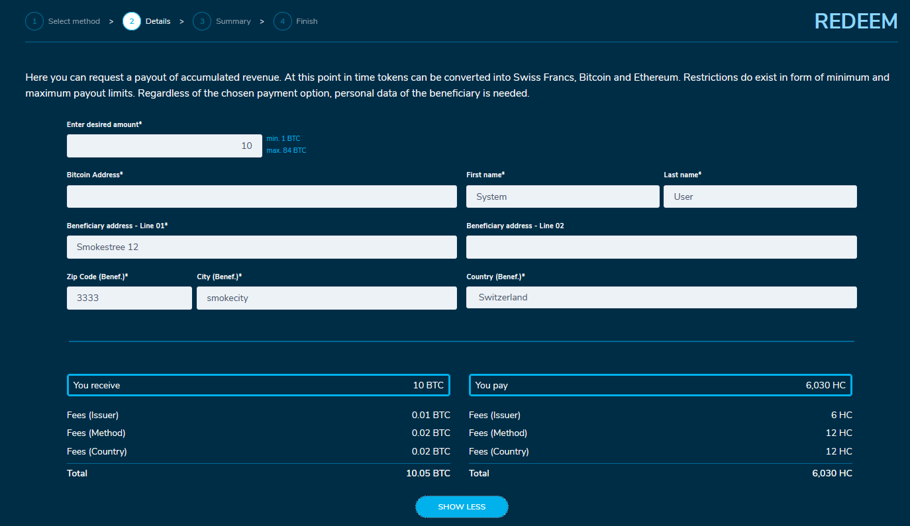

# How your users interact with the portal

## KYC checks

If you enable KYC functionality, availability and visibility of functionality for user is defined by his current KYC tier. Functionality which is not available will be closed by "Get KYC tier N". Users will be forced to go through KYC checks to get required KYC tier.


All users automatically get tier 0 when they register

Users can't have several KYC cases opened


.png>)

.png>)

.png>)

After clicking "Get tier N" user is redirected to KYC provider's page, verification process takes place on the provider's page.

After user passes all necessary checks he is redirected back to the portal. After he gets an admin's approval of KYC tier (process described in [#kyc-management](admin-user-guide/admin-functionality.md#kyc-management "mention")), all functionality configured for this tier will be available for him.

## Shop

Under the section “Shop” all assets configured in the “Config Management” section are listed.

Clicking on “More details” opens the URL set in the config file. Clicking on “Add to cart” allows to add some quantities of this asset to user's shopping cart as shown below.

.png>)

By clicking on the shopping cart on top, the cart opens and shows all items. User can change the quantity of the selected items or remove them.

Click on “Checkout” brings user to the collection method selection screen.&#x20;

As next step user can select how he wants to receive the purchased items. The list of collection methods [can be configured](admin-user-guide/portal-configuration/features-configuration/purchase-assets-and-featured-asset/#collection-methods-configuration) in the “Advanced Configuration Management” editor by admin.

When selecting method “Your own wallet (signable)”, a QR code dialog opens. User can scan the QR code with his WLA to check if the correct wallet is used. This step is optional and can be skipped.

.png>)

After selecting the collection method, further requested details must be provided as shown in the picture below.

.png>)

The details of the order are shown for confirmation after clicking the “Continue” button.

If everything is fine, user goes to selecting the payment method he wants to use. Currently the methods “Bank Transfer”, “Credit Card” and “Bitcoin” are available as shown in the picture. Admin manages them [in cofig file](admin-user-guide/portal-configuration/features-configuration/purchase-assets-and-featured-asset/#payment-methods-configuration).

.png>)

After providing payment method order details will be displayed again and sent to users email.

### Redemption

“Redemption” should be used to convert assets into e.g. Swiss Francs, Bitcoins, Ether, ERC20 Tokens or trigger a physical delivery.

First user needs to select the redeem method as shown below. For each method, a method fee [can be configured](admin-user-guide/portal-configuration/features-configuration/redemption-functionality/). Additionally, each method can be enabled or disabled by admin.

Enter the requested redeem method details and submit the payot.

A summary of the payout details is presented and can be confirmed after accepting the terms and conditions as shown in the picture.

QR code should be scanned with WLA and the transaction must be confirmed. The sparks will be transferred from the account to the configured address and the respective amount.

.png>)

## Account

Here the user can define some information about his account, manage his saved crypto wallets and bank accounts, upgrade his KYC tier.
