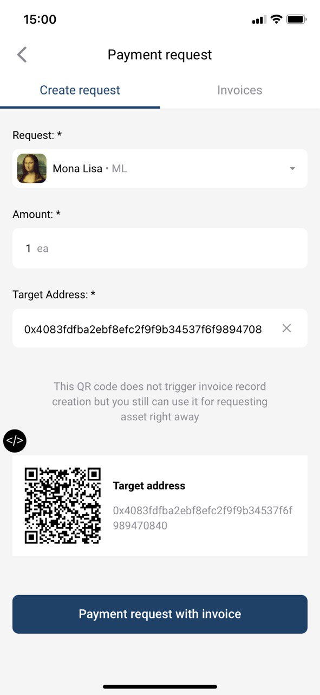
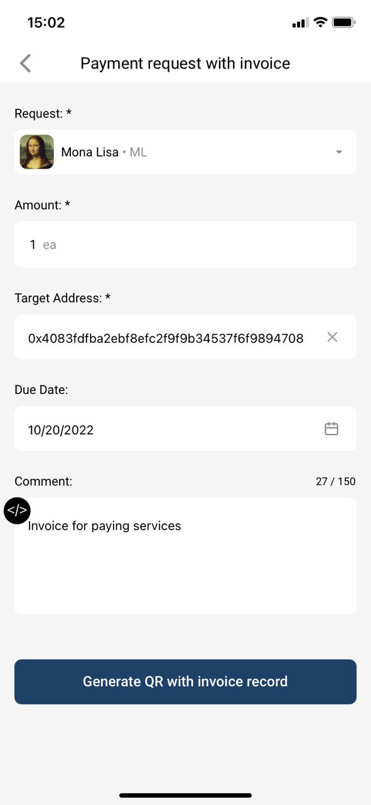
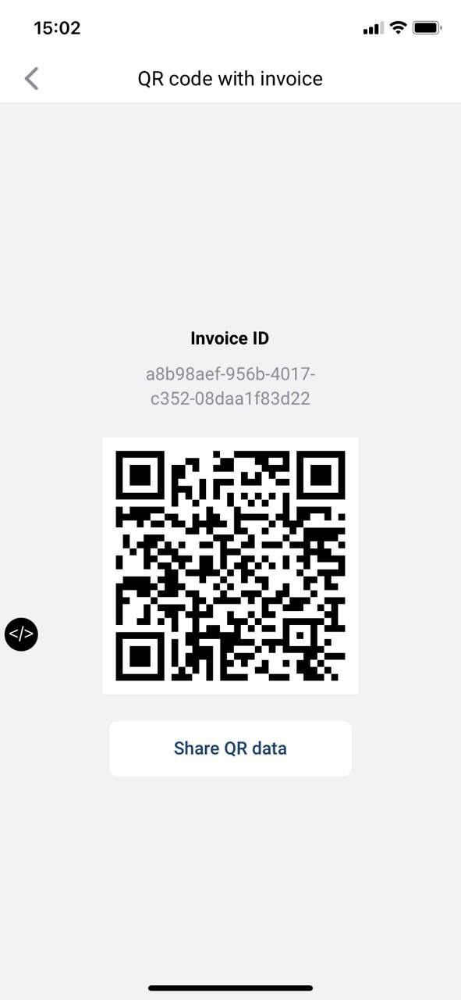

# Payment request & Invoices

If you click on the menu, you can see Payment request menu item where you can select Create request tab for creating a payment request or an invoice.


Difference between payment request and invoice:

Invoice record is created and saved in TEOS. Invoice can expire when expiry date comes.

Payment request is a QR code only, no record in TEOS is created when payment request is generated.


## Payment request generation

You can select an asset and enter an amount to request. A QR code with payment request will be created (see figure below). You can make it bigger and share QR data via any available messenger.

<figure><figcaption>
Figure - Payment request generation
</figcaption></figure>

## Invoice generation

If you need an invoice with the record created in TEOS, you can click on "Payment request with invoice", you will be asked to fill out necessary data (expiry date and target address). Also you can fill the comment which is optional.

<figure><figcaption>
Figure - Invoice generation
</figcaption></figure>

After clicking on "Generate QR code with invoice record" QR code with generated invoice data is displayed. You can find created invoice and check its payment status in Invoices tab.

<figure><figcaption>
Figure - Invoice QR code
</figcaption></figure>

## Paying Payment request and Invoice

Another user then can scan this QR code with his WLA (click on QR in the bottom right corner). If the user accepts the payment request or decides to pay the invoice, a blockchain transaction will be triggered and the requested sparks will be sent to the user who created the payment request or to the target address defined in the invoice.
