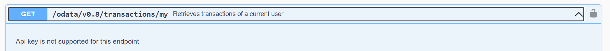

# Additional settings management

## Definition items management

The description of an asset provides valuable information about the asset to potential buyers. Since there is no limitation on e.g. categories of assets which can be issued on the web app, the descriptions might strongly differ depending on the asset. For example, in order to describe metal, you might need different properties than you need for meat. Thus, you may need to create additional properties which can be added to your asset description. You can manage them in the section "Settings" -> “Definition items” in the web app.

The admin of a tenant can define [Asset template](../admin-user-guide/wlm-configuration/templates-management.md#\_ref18675748) and all mandatory fields to fill out. These **main properties** might include e.g. the language, issuer wallet, name, a short description, jurisdiction, asset type, unit of measure and spark factor.&#x20;


First try to click "Create asset" and check how Asset template looks like. If you don't need any additional properties to describe it, you can skip creating custom definition items


#### Create collection of definition items

If you want to create additional properties to describe your asset in more details, you can click on “Settings”, choose “Definition Items” and click on “New Collection”.


Tenant collection and General collection are available for all users by default. Tenant collection is the collection which can be read and edited by admins only.&#x20;


.png>)

Now you can name the collection, describe the collection and you can add any language in which you want to translate the properties. In case Asset translations are added, these properties translations will be used.

.png>)

After you click “Save” the new collection appears in the definition items.

.png>)

If you now select the new collection, you will find on the top right “New Item” and “New Catalog”.

#### Create catalog of definition items, create definition item

A “**New Catalog**” is a new folder in your collection. If you e.g. created a collection for metals, then you might want to divide between precious metals and industrial metals.

.png>)

A “**New Item**” is a specific property, which is needed to describe the asset. In the metal example, one “Item” could be the quality standard of an industrial metal.\
If you click on “New Item”, a form opens. Enter a name for your new item, so the user knows what the item is about. Afterwards describe the item. The description should help the user of the collection to know what value he/she must enter. Additionally, you can choose an appropriate data type. The WLM provides a broad range of data types to be chosen from. In our example we can use a picklist, consisting of the quality standards of a specific metal.

.png>)

In our example, the created item appears now in the “Metals” collection in the catalog “Industrial Metals”. Every catalog and item can be edited, moved, copied, added to the tenant collection and deleted. Just click on the dots on the right side of one item or catalog and choose what you want to do.

.png>)

You can create as much catalogs and as much items as you want to describe your assets in detail. Use them on the step "Additional properties" when creating the asset.

## Filters management

All created filters in Advanced search can be checked and managed under "Settings" -> "Filters".

You can check the clauses of existing filters, duplicate, remove existing filters or add a new one.

If you have corresponding admin permissions, you will be able to check and manage tenant filters along with your private filters. Also you can make your private filter tenant filter and vice versa.

