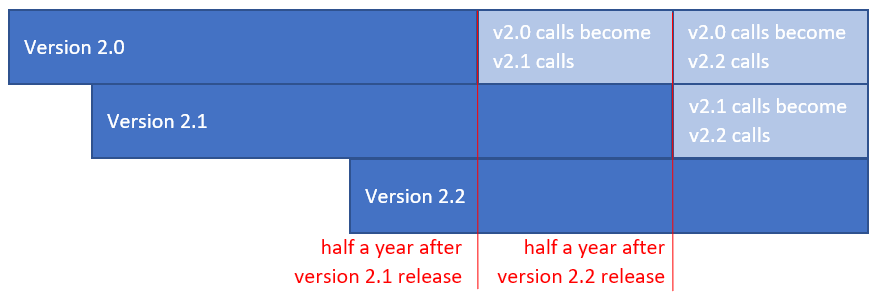

# Platform Versioning

Not all APIs and SDKs share the same versioning system. For example, the TEOS API is versioned with a different pace and numbering compared to the TEOS API SDK. All SDKs support the ability to interact with different versions of our APIs. Multiple versions of APIs or SDKs can exist at the same time with different functionality in each version.

#### What is the latest TEOS API Version? <a href="#latest" id="latest"></a>

The latest TEOS API version is `v0.4`

#### Why do we have versions? <a href="#whyversion" id="whyversion"></a>

The goal for having versioning is for developers building apps to be able to understand in advance when an API or SDK might change. They help with web development, but are critical with mobile development because a person using your app on their phone may take a long time to upgrade (or may never upgrade).

Each version will remain for at least half a year from release giving you a solid timeline for how long your app will remain working, and how long you have to update it to newer versions.

#### Version Schedules <a href="#howlong" id="howlong"></a>

Each version is guaranteed to operate for at least half a year. **A version will no longer be usable half a year after the date that the subsequent version is released.** For example, if API version v2.3 is released on March 25th, 2020 and API version v2.4 is released August 7th, 2020 then v2.3 would expire on February 7th, 2020, half a year after the release of v2.4.

For APIs, once a version is no longer usable, any calls made to it will be defaulted to the next oldest, usable version. Here is a timeline example:



For SDKs, a version will always remain available as it is a downloadable package. However, the SDK may rely upon APIs or methods which no longer work, so you should assume an end-of-life SDK is no longer functional.

You can find specific information about our version timelines, changes, and release dates on our [changelog page](../changelog/).

#### Will everything remain completely unchanged in a version? <a href="#stability" id="stability"></a>

CoreLedger does reserve the right to make changes in any API in a short period of time for issues related to security or privacy or performance. These changes don't happen often, but they do happen.

#### Do I have to specify a version for an API? <a href="#unversioned_calls" id="unversioned_calls"></a>

Yes, the version is a mandatory part of API calls. For example, let's say the current version is v3.2. The call is as follows:

```
curl -i -X "https://teosapi.coreledger.net/odata/v3.2/assets/{asset-id}
```

#### Can my app make calls to versions older than the current version? <a href="#calling_older_versions" id="calling_older_versions"></a>

You can specify older versions in your API calls as long as they are available and your app has made calls to that version. For example, if your app was created after v2.0 was released and makes calls using v2.0, it will be able to make calls to v2.0 until the version expires even after newer versions have been released. If you created your app after v2.0 but did not make any calls until v2.2, your app will not be able to make calls using v2.0 or to v2.1. It will only be able to make calls using v2.2 and newer versions.
