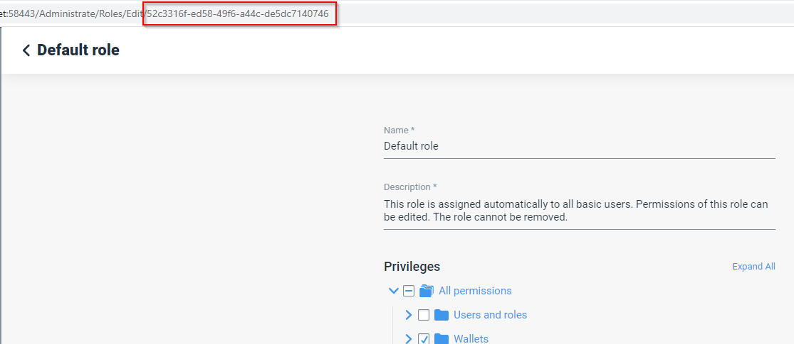

# Step 2 - Register profile in WLM

<figure><figcaption>
Figure 3: Referral code
</figcaption></figure>

If you have a referral code, you can enter it. If the admin didn’t provide you a referral code, you can submit the registration request and click on “Sign Up”.

As you can see on the site (Figure 4), the administrator of your tenant first needs to approve your request, before you can start using with WLM (web app). As soon as your request was approved by the administrator, you will receive an email notification.

After you received the email, click on the provided link. The browser opens with the login screen. Enter your credentials to access the WLM (web app).

If your registration process was successful, you are welcome to check the intro, your start screen will look like in Figure 5.

>)

##
