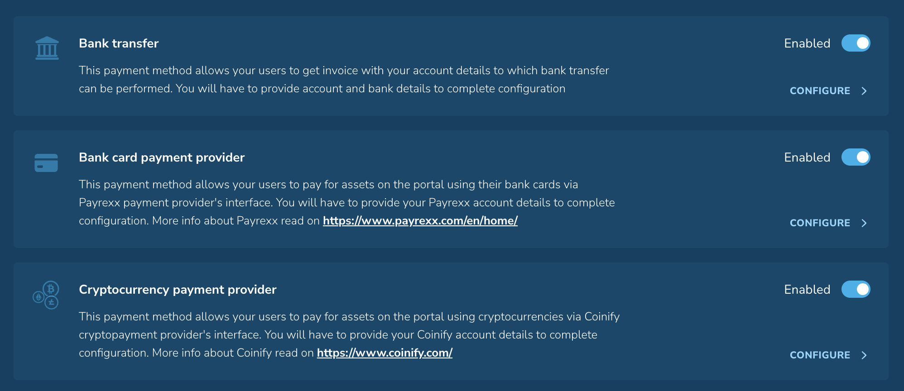

# Version 0.18

With this version **WLP admins and users** can try the following improvements:

👉 Added more flexibility to the Features Page. Custom HTMLs are now localized. You can add pages directly in the languages you need. Read more about [Custom HTML](../admin-user-guide/portal-configuration/how-to-prepare-custom-html.md).

👉 Added support for dynamic pricing. Now you can show your customers not only fixed prices but also send price values through the API. Logging of dynamic asset price data has been added, and this data is now sent to email once a day.

👉 WLP Refurbish registration and sign-in process.  User can check the functionality (but not fully use it) as non-logged in user. Added the ability to check Terms & Conditions and Data policy in the app.

👉 Loading of purchase templates for each payment method has been added to config management. Templates can be uploaded in all languages available in the portal.

<figure><figcaption>
Choose a payment method.
</figcaption></figure>

<figure><figcaption>
Loading purchase templates in the languages you need.
</figcaption></figure>

👉 The Redemption Template was updated to include additional values such as \<currentdate>, \<totalamountfees>, and \<priceperunit>.  This made the template even more informative and allowed admins to add all the necessary information. Read more about [Redemption functionality](../admin-user-guide/portal-configuration/features-configuration/redemption-functionality/).

👉 Adapting the Purchase Template, adding VAT values on the Purchase Document. This enabled us to address requests from our customers who needed VAT displayed during purchases. Users will see it on the invoice.

👉 Added translation for asset name and description for all WLP screens.  If there is no corresponding translation, the default portal language translation is shown.

👉 Decimal places and rounding rules for each asset and price have been added.

👉 Checkout and redemption flow: customized checkboxes for terms have been added.&#x20;

**We've fixed:**

👉 Colors in the user registration email have been updated.

👉  The search bar bug for redemption management has been fixed.

👉 A toast with an error message has been added when the user tries to send more units than available.

👉  A bug with the shipping address for the invoice information has been fixed.

\
